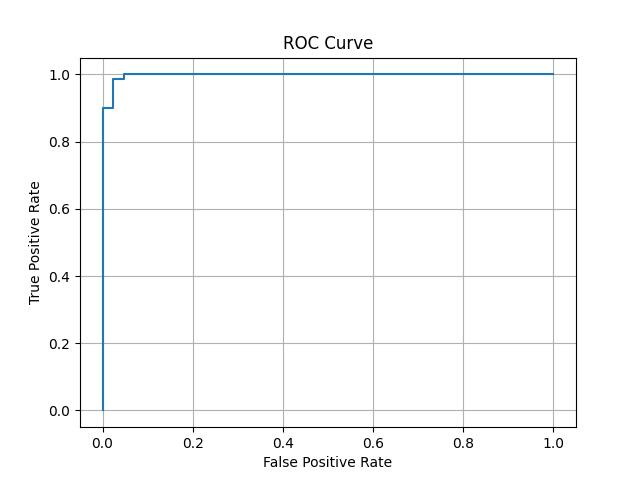

# logistic_regression
# Breast Cancer Classification – Logistic Regression

## Task 4 – AI & ML Internship (Elevate Labs)

### Objective
To build a binary classification model using Logistic Regression to predict whether a tumor is malignant or benign using the Breast Cancer Wisconsin dataset.

---

### Tools & Libraries Used
- Python
- Pandas
- NumPy
- Scikit-learn
- Matplotlib
- Seaborn

---

### Steps Performed
1. Loaded the dataset from `sklearn.datasets.load_breast_cancer`
2. Explored the dataset using `pandas` and `info()`
3. Split the dataset into training and testing sets (80/20 split)
4. Standardized features using `StandardScaler`
5. Built and trained a Logistic Regression model
6. Predicted test results and probabilities
7. Evaluated the model using:
   - Confusion Matrix
   - Classification Report (Precision, Recall, F1-score)
   - ROC-AUC Score
   - ROC Curve

---

### Results Summary

#### Classification Report:
| Metric     | Class 0 (Benign) | Class 1 (Malignant) |
|------------|------------------|----------------------|
| Precision  | 0.98             | 0.97                 |
| Recall     | 0.95             | 0.99                 |
| F1-score   | 0.96             | 0.98                 |

- **Accuracy**: 97%
- **ROC-AUC Score**: **0.997**

---

### ROC Curve

---

### Dataset Source
[ Breast Cancer Wisconsin Dataset – Kaggle](https://www.kaggle.com/datasets/uciml/breast-cancer-wisconsin-data)

---

### Outcome
Successfully completed **Task 4** of the Elevate Labs AI & ML Internship, demonstrating a strong understanding of binary classification, model evaluation, and logistic regression fundamentals.

---

#### 📌 Confusion Matrix:
